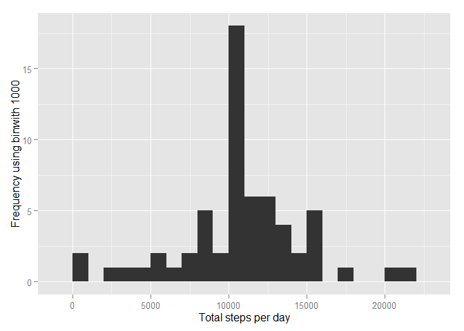
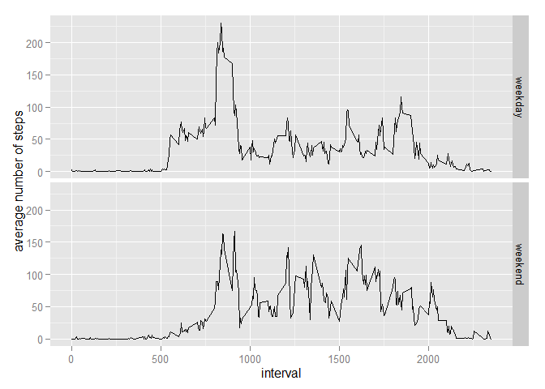

# Reproducible Research: Peer Assessment 1


## Loading and preprocessing the data


```r
require(plyr)
```

```
## Loading required package: plyr
```

```r
require(ggplot2)
```

```
## Loading required package: ggplot2
```

```r
setwd('D:/Program Files/R/R Projects')
unzip("activity.zip")
activity <- read.csv("activity.csv", header = TRUE)
activity <- transform(activity, date = as.Date(date))
```

## What is mean total number of steps taken per day?

Find the total number of steps taken per day.

```r
Steps_Per_Day <- tapply(activity$steps, activity$date, sum, na.rm=TRUE)
```

Plot a histogram of the total number of steps taken per day.

```r
qplot(Steps_Per_Day, xlab='Total steps per day', ylab='Frequency using binwith 1000', binwidth=1000)
```

 

Compute the `mean` and `median` total number of steps taken per day.

```r
meanStepsPerDay <- mean(Steps_Per_Day)
medianStepsPerDay <- median(Steps_Per_Day)
```

- The mean is 9354.2295082
- The median is 10395

## What is the average daily activity pattern?

```r
interval <- aggregate(activity[1],by=activity[3],FUN=mean,na.rm=TRUE)
plot(x=interval$interval, y=interval$steps,main="Average Steps",type="l",
     xlab="Interval", ylab="No. of Steps")
```

 

**Maximum Steps**


```r
max_interval <- interval[interval$steps==max(interval$steps),]

max_interval[1] # maximum interval
```

```
##     interval
## 104      835
```

```r
round(max_interval[2],1) # maximum steps per interval
```

```
##     steps
## 104 206.2
```

The maximum average steps per period occur at interval 835, with an average of 206.2 steps per 5 minutes.

## Imputing missing values

Total number of missing values in the dataset (total number of NAs in all rows)

```r
sum(is.na(activity))
```

```
## [1] 2304
```
Replace NA with mean of 5-minute interval.

```r
activity2 <- transform(activity, steps = ifelse(is.na(steps), ave(steps, interval, 
                      FUN = function(x) mean(x, na.rm = TRUE)), steps))
```
Make a histogram of the total number of steps taken each day and Calculate and report the mean and median total number of steps taken per day.


```r
stepsPerDay2 <- tapply(activity2$steps, activity2$date, sum, na.rm=TRUE)
qplot(stepsPerDay2, xlab='Total steps per day', ylab='Frequency using binwith 1000', binwidth=1000)
```

 
Compute the `mean` and `median` total number of steps taken per day.

```r
meanStepsPerDay2 <- mean(stepsPerDay2)
medianStepsPerDay2 <- median(stepsPerDay2)
```
- The mean is 1.0766189\times 10^{4}
- The median is 1.0766189\times 10^{4}

There are slight difference between in mean and median from the original after imputing the missing data.

## Are there differences in activity patterns between weekdays and weekends?

1. Create a new factor variable in the dataset with two levels - "weekday" and "weekend" indicating whether a given date is a weekday or weekend day.


```r
activity2$dateType <-  ifelse(as.POSIXlt(activity2$date)$wday %in% c(0,6), 'weekend', 'weekday')
```

2. Make a panel plot containing a time series plot


```r
avgActivity2 <- aggregate(steps ~ interval + dateType, data=activity2, mean)
ggplot(avgActivity2, aes(interval, steps)) + 
    geom_line() + 
    facet_grid(dateType ~ .) +
    xlab("interval") + 
    ylab("average number of steps")
```

 
# The Conclusion
Activities on weekdays mostly follow a certain routine thus indicated by peaks over 100 steps. On the other hand, there is a more regular distribution of activities on weekends.
